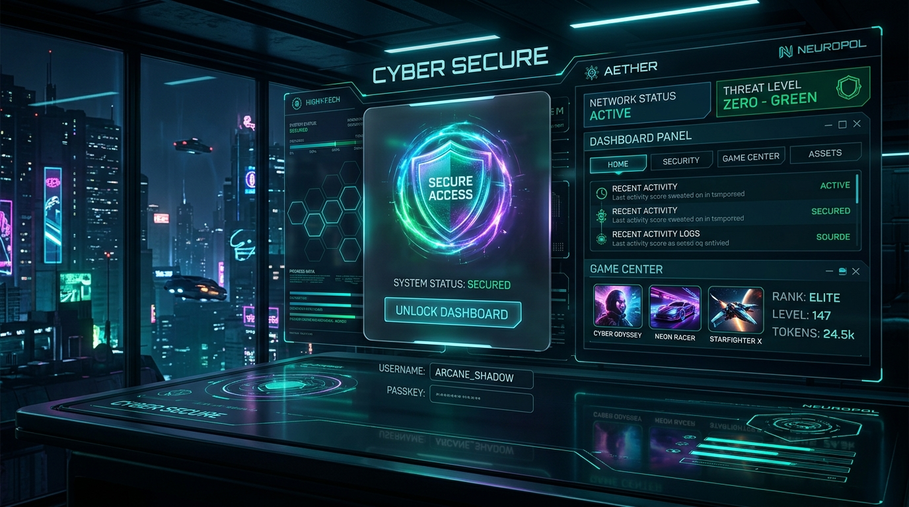

# 🛡️ X-Guard Autonomous Client Command & Security System

[](#)
[](#)
[](#)
[](#)
[](#)

---

### 🌐 Language / زبان‌ها
> 🇮🇷 ** Persian Speaker?** Switch to the Persian edition:  
> 👉 **[مشاهده نسخه فارسی (README_FA.md)](./README_FA.md)**

---

<p align="center">
  
</p>

---

## 📌 Table of Contents
1. [Overview](#-overview)
2. [Key Architecture & Modules](#-key-architecture--modules)
   - [Secure Lock Screen](#1-secure-lock-screen)
   - [Autonomous Gamer Desktop](#2-autonomous-gamer-desktop)
   - [Central Command Admin Panel](#3-central-command-admin-panel)
3. [The Settings Sync Utility](#-the-settings-sync-utility)
4. [Aesthetic & Physical UX Feedback](#-aesthetic--physical-ux-feedback)
5. [Project Directory Structure](#-project-directory-structure)
6. [Getting Started & Installation](#-getting-started--installation)
7. [Creator & Developer Info](#-creator--developer-info)

---

## 🔍 Overview
**X-Guard** is a robust, premium standalone client-side command and security system built for modern cybercafés (gamenets), shared workspaces, and multi-user terminals. Leveraging the power of **React 18**, **Vite**, and **Tailwind CSS**, it features an immersive, eye-safe, glassmorphic dark theme embellished with reactive neon accents. The interface is optimized with native RTL support and fully typography-paired with **Vazirmatn** for pristine Persian rendering.

---

## ⚡ Key Architecture & Modules

### 1. Secure Lock Screen
* **Dual-Login Portal:** Distinct secure authentication pathways for general gamers (Username/Password) and system administrators.
* **Lockout Siren & Safeguard:** Triggers an immersive visual and acoustic siren alarm on 3 consecutive failed password attempts, locking down the host interface for 30 seconds.
* **Pre-Login Voucher Station:** Gamers can redeem scratch/voucher cards directly from the lock screen to top up their playtime before unlocking the desktop.

### 2. Autonomous Gamer Desktop
* **Full-Featured Workspace:** Provides shortcuts, responsive launch modules, interactive sound selectors, and a dynamic real-time Persian/Solar Hijri calendar.
* **Simulated Hardware Firewalls:** Simulates network ports, bandwidth shaping, and automatic locks when active sessions run out of allocated time.
* **Smart Event Logging:** Live, persistent toaster notifications feed real-time event logs (e.g., driver actions, firewall warnings, active connection updates).

### 3. Central Command Admin Panel
* **System Monitors:** Tracks simulated CPU cores, active memory load, internet uplink/downlink speeds, and remaining session timers.
* **Database Vault:** Integrated local storage controllers to add, edit, or delete users and pre-configure voucher activation codes.
* **Gamer Feedback Hub:** A direct communication pipeline to monitor user requests, ratings, and feedback logs.

---

## 🔄 The Settings Sync Utility
A core highlight of **X-Guard** is the **Centralized Settings Sync Utility**. This engine ensures seamless style synchronization between the locked state and active workspace.
* **Automated Sync Engine:** Keeps custom color themes (Cyan, Indigo, Emerald, Fuchsia) and desktop wallpapers aligned. When the active user changes their style, it automatically cascades to the lock screen.
* **Manual Style Transmitters:** Dedicated **Push to Lock Screen** and **Pull from Lock Screen** actions give admins and power users surgical control over style propagation.

---

## 🎨 Aesthetic & Physical UX Feedback
* **Glassmorphism & Neon Shadows:** Soft backdrops featuring fine transparent borders (`border-white/[0.05]`) and custom glowing neon colors.
* **Tactile Taskbar Buttons:** The system icons (Wi-Fi, Volume, Battery status) feature real-time physical click behaviors including a spring-based press-down transition (`whileTap={{ scale: 0.82 }}`) and custom visual ripple waves.
* **Acoustic feedback:** Built-in synthesized sound drivers play custom digital melodies for logins, errors, and system warnings.

---

## 📂 Project Directory Structure
```bash
├── src/
│   ├── components/
│   │   ├── Desktop.tsx         # Primary Gamer Desktop & Admin Command Center
│   │   ├── LockScreen.tsx      # Secure Login, Siren, and Voucher Redeem System
│   │   └── WindowWrapper.tsx   # Glassmorphic, highly animated draggable windows
│   ├── App.tsx                 # Core Router with smooth layout transitions
│   ├── index.css               # Global Tailwinds import, Vazirmatn font styling
│   └── main.tsx                # React virtual DOM mounter
├── index.html                  # Core HTML template
├── metadata.json               # Frame permissions & capability configurations
├── package.json                # Project dependencies and deployment scripts
└── tsconfig.json               # Type safety regulations
```

---

## 🚀 Getting Started & Installation

To run this project locally, execute the following commands in your terminal:

1. **Install Dependencies:**
   ```bash
   npm install
   ```

2. **Boot up the Local Dev Server:**
   ```bash
   npm run dev
   ```
   *The dev environment binds to port 3000: `http://localhost:3000`*

3. **Compile for Production:**
   ```bash
   npm run build
   ```

---

## 👤 Creator & Developer Info

This project was envisioned and developed with absolute dedication to premium engineering and futuristic design.

<div align="center">
  <table style="border: none; background: transparent;">
    <tr>
      <td>
        
      </td>
      <td>
        
      </td>
    </tr>
  </table>

  <h3>Catch up with the Creator! 🚀</h3>
  
  <a href="https://t.me/pokcidman" target="_blank">
    
  </a>
  &nbsp;&nbsp;
  <a href="https://instagram.com/pokcidman" target="_blank">
    
  </a>
  &nbsp;&nbsp;
  <a href="https://github.com/pokcidman" target="_blank">
    
  </a>
</div>

---
*X-Guard Client Command Center — Secure. Fast. Immersive.*
