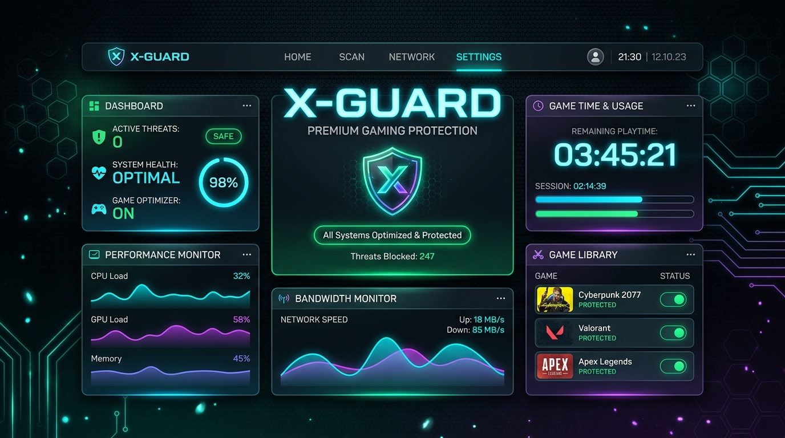

# 🛡️ سامانه هوشمند فرماندهی و امنیت کلاینت X-Guard
[](https://github.com/miroxvy1-lab/X-Guard)
[](https://github.com/miroxvy1-lab/X-Guard)
[](https://github.com/miroxvy1-lab/X-Guard)
[](https://github.com/miroxvy1-lab/X-Guard)
[](https://github.com/miroxvy1-lab/X-Guard)
---

### 🌐 تغییر زبان / Languages
> 🇬🇧 **English User?** Access the default English version of this document:  
> 👉 **[View English Version (README.md)](./README.md)**

---

<p align="center">
  
</p>

---

## 📌 منوی موضوعات (Table of Contents)
۱. [نمای کلی سامانه](#-نمای-کلی-سامانه)  
۲. [معماری کلیدی و بخش‌های اصلی](#-معماری-کلیدی-و-بخشهای-اصلی)  
   - [صفحه قفل امنیتی](#۱-صفحه-قفل-امنیتی)  
   - [دسکتاپ اختصاصی گیمر](#۲-دسکتاپ-اختصاصی-گیمر)  
   - [سامانه مرکزی مدیریت ادمین](#۳-سامانه-مرکزی-مدیریت-ادمین)  
۳. [ابزار قدرتمند همگام‌سازی تنظیمات (Settings Sync)](#-ابزار-قدرتمند-همگامسازی-تنظیمات-settings-sync)  
۴. [زیبایی‌شناسی و بازخوردهای فیزیکی و صوتی](#-زیبایی‌شناسی-و-بازخوردهای-فیزیکی-و-صوتی)  
۵. [ساختار فولدرها و فایل‌ها](#-ساختار-فولدرها-و-فایلها)  
۶. [دستورالعمل نصب و راه‌اندازی](#-دستورالعمل-نصب-و-راهاندازی)  
۷. [معرفی سازنده و اطلاعات تماس](#-معرفی-سازنده-و-اطلاعات-تماس)  

---

## 🔍 نمای کلی سامانه
سامانه **X-Guard** یک نرم‌افزار جامع، مدرن و مستقل (Standalone) برای گیمی‌نت‌ها، کافی‌نت‌ها و پایانه‌های اشتراکی است. این پروژه با استفاده از **React 18**، **Vite** و **Tailwind CSS** طراحی گردیده است. ظاهر برنامه از استایل بسیار شیک شیشه‌ای (**Glassmorphism**) همراه با نورهای نئونی درخشان بهره می‌برد و تایپوگرافی آن کاملاً بر پایه فونت محبوب و خوانای **وزیرمتن (Vazirmatn)** راست‌چین شده است تا بهترین و دلنشین‌ترین تجربه کاربری را به ارمغان آورد.

---

## ⚡ معماری کلیدی و بخش‌های اصلی

### ۱. صفحه قفل امنیتی (Secure Lock Screen)
* **پورتال ورود دوگانه:** قابلیت ورود مجزا برای گیمرها (با نام کاربری و رمزعبور اختصاصی) و مدیران سیستم (ادمین کل).
* **آژیر قفل حفاظتی (Lockout Siren):** در صورتی که کاربری ۳ مرتبه متوالی رمز عبور اشتباه وارد کند، آژیر قرمز نئونی صوتی و بصری به همراه تایمر ۳۰ ثانیه‌ای فعال شده و سیستم کاملاً مسدود می‌شود.
* **تمدید شارژ پیش از ورود:** گیمرها می‌توانند مستقیم از لاک اسکرین کدهای شارژ (Voucher) خریداری شده را وارد کرده و شارژ حساب خود را افزایش دهند.

### ۲. دسکتاپ اختصاصی گیمر (Autonomous Gamer Desktop)
* **میز کار همه‌جانبه:** آیکون برنامه‌ها، میانبر تنظیمات صدا، وای‌فای، منوی استارت شکیل و تقویم فارسی زنده (خورشیدی).
* **سپرها و فایروال شبیه‌سازی شده:** شبیه‌ساز بستن خودکار پورت‌ها، فایروال کلاینت و سیستم کنترل زمان کارکرد که پس از اتمام شارژ، کاربر را فوراً به صفحه قفل منتقل می‌کند.
* **لاگ سیستم زنده (Toasts):** نمایش آنی تغییرات فایروال و پچ‌های کلاینت به صورت بنرهای زیبا در دسکتاپ.

### ۳. سامانه مرکزی command ادمین
* **داشبورد مانیتورینگ:** پایش زنده هسته‌های پردازنده، میزان مصرف حافظه کلاینت، تست پهنای باند و سرعت آپلود/دانلود شبکه.
* **مدیریت کامل اکانت‌ها و کدهای شارژ:** پنل فوق‌العاده زیبا برای تعریف حساب‌های کاربری جدید، افزایش دستی دقیقه‌های جلسه و تولید کدهای شارژ جدید.
* **صندوق بازخورد:** امکان بررسی و مدیریت بازخوردها و نظرات گیمرهای وارد شده به سیستم.

---

## 🔄 ابزار قدرتمند همگام‌سازی تنظیمات (Settings Sync)
یکی از پیشرفته‌ترین قابلیت‌های کلاینت، **Centralized Settings Sync** نام دارد. این ابزار به کاربر و ادمین اجازه می‌دهد پوسته‌های گرافیکی و تصویر پس‌زمینه انتخابی خود را بین حالت دسکتاپ و صفحه قفل هماهنگ سازند.
* **همگام‌ساز خودکار:** با فعال بودن سوییچ مربوطه، تمامی انتخاب‌های رنگ‌های نئونی (آبی، ارغوانی، سبز، صورتی) و تصاویر پس‌زمینه فوراً و به طور هوشمند روی لاک‌اسکرین کلاینت نیز بازتاب می‌یابد.
* **انتقال‌دهنده دستی (Push/Pull):** قابلیت انتقال دستی پوسته دسکتاپ به قفل و یا دریافت پوسته فعال قفل و اعمال آن روی دسکتاپ گیمر با بازخوردهای متحرک.

---

## 🎨 زیبایی‌شناسی و بازخوردهای فیزیکی و صوتی
* **نورهای نئونی خیره‌کننده:** سایه‌ها و مرزهای شیشه‌ای ظریف و درخشان که در محیط‌های تاریک کافی‌نت‌ها خستگی چشم را به حداقل می‌رساند.
* **دکمه‌های تعاملی لمسی (Tactile Buttons):** آیکون‌های وای‌فای، ولوم صدا و باتری نوار وظیفه به انیمیشن‌های فشرده‌سازی (`whileTap`) مجهز شده‌اند و هنگام کلیک، موج‌های ریپل (Ripple) بسیار زیبایی منتشر می‌کنند.
* **هشدارهای صوتی دیجیتال:** استفاده از موتور صوتی سنتز شده برای پخش بوق‌های خطای دسترسی، تایید هویت و آژیر هشدار امنیتی.

---

## 📂 ساختار فولدرها و فایل‌ها
```bash
├── src/
│   ├── components/
│   │   ├── Desktop.tsx         # فایل محوری دسکتاپ گیمر و داشبورد مدیریت ادمین
│   │   ├── LockScreen.tsx      # سیستم مدیریت قفل، آژیرهای هشدار و افزایش شارژ
│   │   └── WindowWrapper.tsx   # کانتینر شیشه‌ای، متحرک و واکنش‌گرای پنجره‌ها
│   ├── App.tsx                 # اتصال‌دهنده دسکتاپ و قفل با افکت‌های زیبای فید
│   ├── index.css               # استایل‌های سراسری، فونت‌های وزیرمتن و متغیرهای تم
│   └── main.tsx                # نقطه ورود فریم‌ورک React
├── index.html                  # قالب HTML پایه پروژه
├── metadata.json               # مجوزها و قابلیت‌های اصلی سامانه
├── package.json                # مدیریت کتابخانه‌ها و اسکریپت‌های توسعه
└── tsconfig.json               # پیکربندی کامپایلر تایپ‌اسکریپت
```

---

## 🚀 دستورالعمل نصب و راه‌اندازی

برای اجرای لوکال پروژه، به سادگی دستورات زیر را در خط فرمان سیستم خود وارد کنید:

۱. **نصب پکیج‌های پیش‌فرض:**
   ```bash
   npm install
   ```

۲. **راه‌اندازی سرور محلی توسعه:**
   ```bash
   npm run dev
   ```
   *سرویس بر روی پورت ۳۰۰۰ به آدرس `http://localhost:3000` لود می‌شود.*

۳. **خروجی گرفتن برای انتشار نهایی (Production):**
   ```bash
   npm run build
   ```

---

## 👤 معرفی سازنده و اطلاعات تماس

این اثر با عشق، ظرافت و رعایت کامل اصول مهندسی نرم‌افزار و طراحی‌های سایبرپانک توسعه یافته است.

<div align="center">
  <table style="border: none; background: transparent;">
    <tr>
      <td>
        
      </td>
      <td>
        
      </td>
    </tr>
  </table>

  <h3>راه‌های ارتباط مستقیم با سازنده 🚀</h3>
  
  <a href="https://t.me/pokcidman" target="_blank">
    
  </a>
  &nbsp;&nbsp;
  <a href="https://instagram.com/pokcidman" target="_blank">
    
  </a>
  &nbsp;&nbsp;
  <a href="https://github.com/pokcidman" target="_blank">
    
  </a>
</div>

---
*سامانه فرماندهی و کلاینت X-Guard — ایمن، هوشمند، بی‌نقص.*
